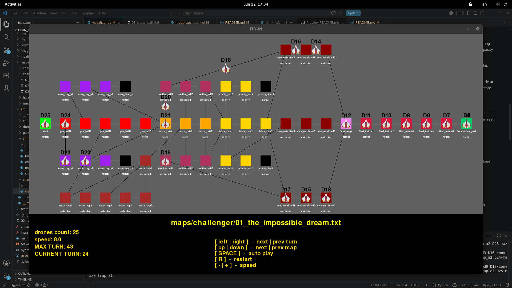

*This project has been created as part of the 42 curriculum by \<danborys\>*

## Description ##

The project implements a drone routing system that efficiently moves a fleet of drones from a start hub to an end hub while respecting a set of movement, capacity, and scheduling constraints.

Each map is represented as a graph of interconnected zones (hubs) linked by connections. The system parses the map, builds an internal simulation model, computes routes for all drones, and visualizes the resulting simulation.

## Instructions

For simple start use `make run`.

This command runs the program with the default map: '**maps/easy/01_linear_path.txt'** and **'--visual'** flag

For changing maps or enabling flags, use:

`make run ARGS="--map-path=[map] [--debug] [--visual]"`

or

`uv run python3 -m src --map-flag=[your_map_path] [--debug] [--visual]`

Using '=' is allowed only with **--map-path flag**.
Max drones count is 100.

## Implementation strategy ##
The workflow consists of the following stages:

1. **ConfigBuilder**

    Builds an AppConfig object containing command-line flags, application settings, and information about the selected map.
This configuration is used throughout the entire application lifecycle.

2. **MapParser**

    Parses all map files located in the maps/ directory.
Returns a dictionary where the key is the map name and the value is a list of parsed map elements.

3. **SimulationBuilder**

    Converts parsed elements into mutable domain objects such as Hub, Connection, and Drone.
Creates a Simulation object representing the complete state of a map.

4. **Solver**

    Processes each Simulation.
Computes a route for every drone while taking movement costs, capacities, and reservations into account.
Stores the resulting path directly in each drone object.

5. **Visualizer**

    Receives the solved simulations.
Provides a graphical representation of the network and drone movements, allowing the user to observe the simulation turn by turn.

## Algorithm choices ##

The routing system uses a reservation-based greedy pathfinding approach designed to efficiently schedule multiple drones while respecting zone and connection capacity constraints.

<u>Heuristic Preprocessing</u>

Before routing drones, the solver computes a heuristic value for every reachable hub. This heuristic is generated using a reverse Dijkstra search starting from the destination hub. The resulting value represents the estimated remaining travel cost to the goal while taking zone types into account:
```
        {
            ZoneType.NORMAL: 1.0,
            ZoneType.RESTRICTED: 2.0,
            ZoneType.PRIORITY: 0.9
        }
```

These heuristic values guide all routing decisions.

<u>Reservation System</u>

To prevent conflicts between drones, the solver maintains a reservation map that records:

Hub occupancy for each simulation turn.
Connection occupancy for each simulation turn.
```
class ReservationMap:
    def __init__(self) -> None:
        self.nodes: Dict[Tuple[Hub, int], int] = {}
        self.edges: Dict[Tuple[Connection, int], int] = {}
```
When a drone is assigned a path, all occupied hubs and connections are reserved in advance. Future drones must respect these reservations when planning their routes.

<u>Pathfinding Strategy</u>

Drones are routed sequentially. For each drone, the solver evaluates all immediately reachable neighbouring hubs and selects the candidate with the lowest heuristic value that does not violate any reservation or capacity constraints.

The algorithm also allows a drone to remain in its current hub when movement is temporarily blocked. This waiting action enables the solver to handle congestion and avoid invalid movements.

Because decisions are driven primarily by the precomputed heuristic values, the algorithm behaves similarly to a **Greedy Best-First Search**. Unlike A*, it does not evaluate the full path cost from the start hub and therefore prioritizes hubs that appear closest to the destination according to the heuristic.

## Visual Representation ##

The project includes a graphical visualizer built with Pygame that allows users to observe the simulation in real time and analyze the behaviour of the routing algorithm.
<p align="center">
  
</p>

<u>Network Visualization</u>

The visualizer displays the complete drone network:

Hubs are rendered according to their coordinates defined in the map file.
Connections between hubs are displayed as lines.
Hub colors specified in the map metadata are respected when possible.
Each hub displays its name and zone type, making it easy to identify normal, priority, restricted, and blocked zones.

<u>Drone Visualization</u>

Every drone is represented by a graphical icon and a unique identifier.

During the simulation:

Drone positions are animated between hubs.
Movement between turns is interpolated to provide smooth transitions.
Multiple drones can be tracked simultaneously throughout the network.
Playback Controls

The visualizer provides several interactive controls:
```
Left / Right Arrow    –    Move backward or forward one simulation turn.
Up / Down Arrow       –    Switch between available maps.
Space                 –    Enable automatic playback.
R                     –    Restart the current simulation.
+ / -                 –    Adjust playback speed.
```

The graphical representation significantly improves the understanding of the simulation by allowing users to:

Verify that routing constraints are respected.
Observe congestion and waiting behaviour.
Analyze drone distribution across multiple paths.
Identify bottlenecks caused by hub or connection capacities.
Compare the efficiency of different routing strategies.

Without the visualizer, understanding drone interactions would require manually analyzing textual output. The graphical interface provides immediate feedback and makes debugging, testing, and evaluating the routing algorithm considerably easier.

## Resources

- [Red Blob Games: Introduction to A* Pathfinding](https://www.redblobgames.com/pathfinding/a-star/introduction.html)
- [Master Python by making 5 games](https://www.youtube.com/watch?v=8OMghdHP-zs&t=679s)
- [pygame docs](https://www.pygame.org/docs/)

### AI usage

ChatGPT was used as a learning and development assistant throughout the project.

Its primary uses included:

 - Reviewing and analyzing existing code to identify bugs, design issues, and potential improvements.
 - Discussing pathfinding algorithms and routing strategies.
 - Improving code readability and maintainability through refactoring suggestions.
 - Writing docs for the Visualizer class
 - Drafting and structuring this README.md
